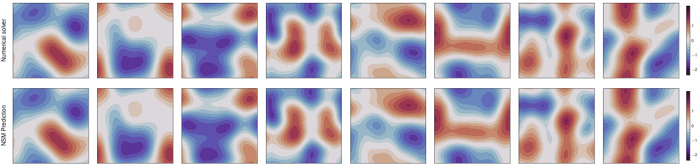

<h1> Neural Spectral Methods </h1>

This repo contains the JAX implementation of our ICLR 2024 paper,

*Neural Spectral Methods: Self-supervised learning in the spectral domain*.
<br />
Yiheng Du, Nithin Chalapathi, Aditi Krishnapriyan.
<br />
https://arxiv.org/abs/2312.05225.

Neural Spectral Methods (NSM) is a class of machine learning method designed for solving parametric PDEs within the spectral domain. Above is a demonstration of NSM's prediction of the 2D Navier-Stokes equation.

> We present Neural Spectral Methods, a technique to solve parametric Partial Differential Equations (PDEs), grounded in classical spectral methods. Our method uses orthogonal bases to learn PDE solutions as mappings between spectral coefficients. In contrast to current machine learning approaches which enforce PDE constraints by minimizing the numerical quadrature of the residuals in the spatiotemporal domain, we leverage Parseval’s identity and introduce a new training strategy through a spectral loss. Our spectral loss enables more efficient differentiation through the neural network, and substantially reduces training complexity. At inference time, the computational cost of our method remains constant, regardless of the spatiotemporal resolution of the domain. Our experimental results demonstrate that our method significantly outperforms previous machine learning approaches in terms of speed and accuracy by one to two orders of magnitude on multiple different problems. When compared to numerical solvers of the same accuracy, our method demonstrates a 10× increase in performance speed.

## Code structure

The structure of this codebase is outlined in the [`src`](src) directory. This includes definitions for [PDE systems](src/pde), utilities for [orthogonal basis](src/basis), and general implementations of [baseline models](src/model). This codebase is self-contained and can serve as a standalong module for other purposes. To experiment with new problems, follow the templates for instantiating the abstract PDE class in the [`src/pde`](src/pde) directory.

### Arguments

`main.py` accepts command line arguments as specified below. Refer to each bash script in the `run` directory for configurations of each experiment.

```
usage: main.py [-h] [--seed SEED] [--f64] [--smi] [--pde PDE] [--model {fno,sno}]
               [--spectral] [--hdim HDIM] [--depth DEPTH] [--activate ACTIVATE]
               [--mode MODE [MODE ...]] [--grid GRID] [--fourier] [--cheb]
               {train,test} ...

positional arguments:
  {train,test}
    train               train model from scratch
    test                enter REPL after loading

optional arguments:
  -h, --help            show this help message and exit
  --seed SEED           random seed
  --f64                 use double precision
  --smi                 profile memory usage
  --pde PDE             PDE name
  --model {fno,sno}     model name
  --spectral            spectral training
  --hdim HDIM           hidden dimension
  --depth DEPTH         number of layers
  --activate ACTIVATE   activation name
  --mode MODE [MODE ...]
                        number of modes per dim
  --grid GRID           training grid size
  --fourier             fourier basis only
  --cheb                using chebyshev
```

```
usage: main.py train [-h] --bs BS --lr LR [--clip CLIP] --schd SCHD --iter ITER
                     --ckpt CKPT --note NOTE [--vmap VMAP] [--save]

optional arguments:
  -h, --help   show this help message and exit
  --bs BS      batch size
  --lr LR      learning rate
  --clip CLIP  gradient clipping
  --schd SCHD  scheduler name
  --iter ITER  total iterations
  --ckpt CKPT  checkpoint every n iters
  --note NOTE  leave a note here
  --vmap VMAP  vectorization size
  --save       save model checkpoints
```

```
usage: main.py test [-h] [--load LOAD]

optional arguments:
  -h, --help   show this help message and exit
  --load LOAD  saved model path
```

## Run

### Environment

```bash
## We are using jax version 0.4.7.

pip install -r run/requirements.txt

## Please install jaxlib based on your own machine configuration.

pip install https://storage.googleapis.com/jax-releases/<VERSION>
```

### Quick test

```bash
python main.py test
```

### Train models

- Local machine

```bash
## Generate data ..

python -m src.pde.<NAME>.generate <ARGS>

## .. and launch.

bash run/<NAME>.sh
```

- Cloud compute

```bash
## Using [SkyPilot](https://skypilot.readthedocs.io).
## Launch cloud jobs based on .yaml configurations ..

sky launch -c ns run/navierstokes.yaml
sky exec ns bash run/navierstokes.sh --env seed=<SEED>

## .. and collect data.

rsync -Pavzr ns:~/sky_workdir/log log/gcp
```

### Plot results

```bash
python -m plot.<NAME>
```

### Trouble shooting

1. The `XLA_PYTHON_CLIENT_MEM_FRACTION` environment variable in the script maximizes memory utilization. This is beneficial if your machine has limited memory (e.g. less than 32GB of GPU memory), but it can lead to initialization issues in certain edge cases. If such issues arise, simply remove the line.

2. For machines with very limited memory (e.g. 16GB of GPU memory), consider setting the `vmap` environment variable to a small integer. This allows loop-based mapping across the batch dimension and uses vectorization only for the number of elements specified by the `vmap` argument. While this approach saves GPU memory, it makes the FLOP measurements for each model inaccurate. Keep this in mind when interpreting the cost estimation message in each run.

## Timeline

- 2023.12.9: initial commit
- 2023.12.11: add arXiv link
- 2023.12.22: release code
- 2024.01.19: update citation
- 2024.01.31: update ICLR citation

## Citation

If you find this repository useful, please cite our work:

```
@article{du2024neural,
  title={Neural Spectral Methods: Self-supervised learning in the spectral domain},
  journal={The Twelfth International Conference on Learning Representations},
  author={Du, Yiheng and Chalapathi, Nithin and Krishnapriyan, Aditi},
  year={2024}
}
```

